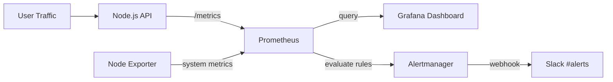

# Production Monitoring Stack

A production-grade observability stack built on AWS EC2, featuring real-time metrics collection, visualization, and alerting.

## Architecture

## Tech Stack

- AWS EC2 — Ubuntu 22.04 hosting environment
- Docker and Docker Compose — container orchestration
- Node.js + prom-client — instrumented REST API
- Prometheus — metrics collection and alert rules
- Grafana — visualization dashboards
- Alertmanager — alert routing and Slack notifications
- Node Exporter — system metrics CPU, memory, disk

## Features

- HTTP request rate monitoring across all routes
- Error rate tracking with 5xx detection
- p95 response time measurement
- CPU usage monitoring
- Slack alerts when error rate exceeds 5% or CPU exceeds 80%
- Full infrastructure as code — one command to start everything

## Setup Instructions

### Prerequisites
- AWS EC2 instance Ubuntu 22.04
- Docker and Docker Compose installed
- Slack webhook URL

### Installation

1. Clone the repository

git clone https://github.com/JULIET-JULIET632/monitoring-stack.git
cd monitoring-stack

2. Create your environment file

cp .env.example .env
nano .env
Add your Slack webhook URL

3. Create alertmanager config

nano alertmanager/alertmanager.yml
Add your Slack webhook URL following the template in the repo

4. Start the full stack

docker compose up -d

5. Verify all services are running

docker compose ps

## Access the Services

Grafana: http://your-ec2-ip:3000 login admin/admin123
Prometheus: http://your-ec2-ip:9090
Alertmanager: http://your-ec2-ip:9093
Node.js API: http://your-ec2-ip:3001

## Grafana Dashboard Panels

HTTP Request Rate — rate(http_requests_total[5m])
Requests per second across all routes

Error Rate % — rate(http_requests_total{status_code=~"5.."}[5m]) / rate(http_requests_total[5m]) * 100
Percentage of 5xx errors over last 5 minutes

p95 Response Time — histogram_quantile(0.95, rate(http_request_duration_seconds_bucket[5m]))
Response time experienced by slowest 5% of users

CPU Usage % — 100 - (avg by(instance) (rate(node_cpu_seconds_total{mode="idle"}[5m])) * 100)
Server CPU load averaged across all cores

## Alert Rules

HighErrorRate — error rate greater than 5% for 1 minute — severity critical
HighCPUUsage — CPU greater than 80% for 2 minutes — severity warning

## Design Decisions

p95 over average — averages hide tail latency, p95 shows what the slowest users actually experience
5% error threshold — industry standard SLO boundary for APIs
1 minute for duration — prevents false alerts from brief traffic spikes
Docker Compose — makes the entire stack reproducible and portable with one command

## Project Structure

monitoring-stack/
├── app/
│   ├── index.js
│   ├── package.json
│   └── Dockerfile
├── prometheus/
│   ├── prometheus.yml
│   └── alert.rules.yml
├── grafana/
│   └── provisioning/
│       └── datasources/
│           └── datasource.yml
├── alertmanager/
│   └── alertmanager.yml
├── docker-compose.yml
└── .env.example

## Author

Juliet — DevOps Engineer
GitHub: https://github.com/JULIET-JULIET632
LinkedIn: https://linkedin.com/in/uchean-juliet-b18b75352
